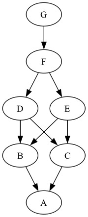

# 2023 Day 22

## Part 1

[Today's probem](https://adventofcode.com/2023/day/22) is a lot like 3-D tetris: let the blocks fall until they're blocked by something.  Then figure out which blocks can be removed without causing the ones above them to fall.

### Parsing

Let's represent a `Problem` as a list of blocks:

```haskell
-- A 3-D point
type Point3 = V3 Int

-- A block is defined by two points that specify the min/max for x, y, and z 
type Block = (Point3, Point3)

-- A problem is a list of blocks in positions where they can fall. 
type Problem = [Block]
```

Then parsing can go like this:

```haskell
-- | Parse the input file
parse :: String -> Problem
parse = map parseLine . lines

-- | Convert one line of input into a Block 
--
-- >>> parseLine "0,1,6~2,1,6"
-- (V3 0 1 6,V3 2 1 6)
parseLine :: String -> Block 
parseLine lineString = 
    (parsePoint lhs, parsePoint rhs)
    where 
        [lhs, rhs] = splitOn "~" lineString 
        parsePoint pointString = 
            V3 x y z 
            where 
                [x, y, z] = map read . splitOn "," $ pointString
```

### How big is the problem?

There are 1488 blocks in my input.

```
$ wc -l input.txt
    1488 input.txt
```

How big is the volume we're talking about?  There are no negative numbers.

```
$ grep -- - input.txt
$ 
```

Writing a temporary `part1` function shows the maximum x, y, and z.  The x and y only go up to 9, while the z value goes as high as 372.  That's a lot smaller than I expected!

```haskell
part1 :: Problem -> Point3
part1 problem =
  V3 (maximum . map getX $ allPoints) (maximum . map getY $ allPoints) (maximum . map getZ $ allPoints)
  where
    allPoints = concatMap bothPoints problem
    bothPoints (p1, p2) = [p1, p2]
    getX (V3 x _ _) = x
    getY (V3 _ y _) = y
    getZ (V3 _ _ z) = z
```

That's small enough we can expand each block into its component cubes and check each cube for overlap.  I think it will work to have a map from `Point3` to block number holding the positions of the cubes for all blocks that have falled down and stopped.

### Cubes in a block

This function will translate a block into its constituent cubes.  The problem says that every block is 1x1xN, with different orientations.  This code is a little over-general, in that it works for NxMxP blocks.

```haskell
type Cube = Point3 

-- | All of the cubes in a block 
--
-- >>> cubesInBlock (V3 1 1 4, V3 1 1 1)
-- [V3 1 1 1,V3 1 1 2,V3 1 1 3,V3 1 1 4]
cubesInBlock :: Block -> [Point3]
cubesInBlock (V3 x0 y0 z0, V3 x1 y1 z1) =
    [ V3 x y z | 
      x <- values x0 x1,
      y <- values y0 y1,
      z <- values z0 z1
    ]
    where 
        -- range that works for ends specified in either order 
        values :: Int -> Int -> [Int]
        values a b = [(min a b) .. (max a b)]
```

### Falling 

This `falling` function describes how a set of cubes falls: z values keep getting reduced by 1.

```haskell
-- | Infinite sequence of positions of a set of cubes as it falls.
--
-- >>> take 3 (falling [V3 1 1 3,V3 1 1 4])
-- [[V3 1 1 3,V3 1 1 4],[V3 1 1 2,V3 1 1 3],[V3 1 1 1,V3 1 1 2]]
falling :: [Cube] -> [[Cube]]
falling = iterate (map (mapz (\n -> n - 1)))

-- | Update the Z value in a point
mapz :: (a -> a) -> V3 a -> V3 a
mapz f (V3 x y z) = V3 x y (f z)
```

### Landing

To know when a block stops falling, we'll need to keep track of the positions of existing blocks.  For now, let's try keeping them in a map from cube position to block number.  If we have one of those maps, this function will drop a set of cubes until it lands on something.

```haskell
-- | Drops a set of cubes until it hits the ground or an already-falled cube.
-- The answer is the last position when falling that doesn't hit the ground or an existing cube.
--
-- >>> dropCubes M.empty [V3 3 4 5]
-- [V3 3 4 1]
--
-- >>> dropCubes (M.fromList [(V3 2 2 2, 1)]) [V3 2 2 5, V3 2 3 5]
-- [V3 2 2 3,V3 2 3 3]
dropCubes :: M.Map Point3 Int -> [Cube] -> [Cube]
dropCubes existing =
  last . takeWhile (all cubeOk) . falling
  where
    cubeOk p = M.notMember p existing && 0 < getZ p
    getZ (V3 _ _ z) = z
```

### Dropping all the blocks

To stack up all the blocks, we'll need to drop them in order.  And we'll need to number them and add each one to the map as it's dropped.

```haskell
-- | Drop a set of cubes that has a block number and add it to the map.
--
-- >>> dropAndInsert M.empty ([V3 3 3 5, V3 3 3 6], 1)
-- fromList [(V3 3 3 1,1),(V3 3 3 2,1)]
dropAndInsert :: M.Map Point3 Int -> ([Cube], Int) -> M.Map Point3 Int
dropAndInsert existing (cubes, blockNum) =
  insertAll (dropCubes existing cubes) blockNum existing
  where
    insertAll ks v m0 = foldl' (\m k -> M.insert k v m) m0 ks

-- | Drop all of the blocks and create a map of them all.
--
-- >>> dropAllBlocks [[V3 2 3 4], [V3 2 3 7, V3 3 3 7], [V3 3 3 9]]
-- fromList [(V3 2 3 1,1),(V3 2 3 2,2),(V3 3 3 2,2),(V3 3 3 3,3)]
dropAllBlocks :: [[Cube]] -> M.Map Point3 Int
dropAllBlocks blocks =
  foldl' dropAndInsert M.empty (zip bottomToTop [1 ..])
  where
    bottomToTop = sortOn minZ blocks
    minZ = minimum . map getZ
    getZ (V3 _ _ z) = z
```

### Testing: Check results 

The description of the problem the expected results of dropping all the blocks for the test data.  Let's make the same chart and see if it's right.

This is the expected state looking from out on the x axis, with positive y to the right, and positive z up.  The blocks are named `['A' ..]`

```
 y
012
.G. 6
.G. 5
.F. 4
??? 3 z
B.C 2
AAA 1
--- 0
```

This code produces the same diagram, without the axis labels:

```haskell
-- | Create a diagram with Y and Z axes, like in the problem description.
diagramXZ :: Problem -> String
diagramXZ problem =
  gridFormat grid
  where
    m = dropAllBlocks . map cubesInBlock $ problem
    yzToBlockNums = mtsFromList . map (first p3ToXz) . M.toList $ m
    grid = gridFromList . map (second (blocksToChar . S.toList)) . M.toList $ yzToBlockNums
    p3ToXz (V3 x _ z) = V2 x (negate z)

-- | When making diagrams, what letter to show, given the list of blocks in that square
blocksToChar :: [Int] -> Char
blocksToChar [] = '.'
blocksToChar [n] = ['A' ..] !! (n - 1)
blocksToChar _ = '?'
```

### Building an is-resting-on relation 

It seems like it would be useful to have a relation that says a block is resting on another block.  Let's make a list of pairs `(topBlock, blockSupportingIt)`.

```haskell
-- | Builds the relation is-resting-on as a list of pairs.
--
-- The map is sorted on points, which will group points with the same x and y,
-- and sort by z within that.  We can look at adjacent items in the list to
-- find one block sitting on another.
--
-- >>> makeIsRestingOn (M.fromList [(V3 3 3 5, 5), (V3 3 3 3, 3), (V3 3 3 2, 2)])
-- [(3,2)]
makeIsRestingOn :: M.Map Point3 Int -> [(Int, Int)]
makeIsRestingOn =
  mapMaybe checkOne . pairs . M.toList
  where
    checkOne :: ((Point3, Int), (Point3, Int)) -> Maybe (Int, Int)
    checkOne ((V3 x1 y1 z1, b1), (V3 x2 y2 z2, b2)) =
      if x1 == x2 && y1 == y2 && z1 + 1 == z2 && b1 /= b2
        then Just (b2, b1)
        else Nothing
```

### Wiring it up 

I think that's about all the pieces, now let's wire them up.

```haskell
part1 :: Problem -> Int
part1 problem =
  S.size canRemove
  where
    -- Build a map from block number to the set of blocks it's resting on
    isRestingOn = mtsFromList . makeIsRestingOn . dropAllBlocks . map cubesInBlock $ problem

    -- If block A is resting on a set of only one block B, then block B cannot be removed.
    cannotRemove = S.fromList . map (head . S.toList) . filter ((== 1) . S.size) . M.elems $ isRestingOn

    -- All block numbers
    allBlocks = S.fromList [1 .. length problem]

    -- Block numbers that can be removed
    canRemove = S.difference allBlocks cannotRemove
```

That did it.

## Part 2

Part 2 asks for us to compute, for each block, the number of blocks that would disintegrate because of removing just it.

Having a picture to look at would be nice.  Let's generate a diagram for the test data by writing a temporary function for part 2 that generates a [dot file](https://graphviz.org/doc/info/lang.html) for a graph where edges represent "rests on".

```haskell
part2 :: Problem -> Int
part2 problem =
  trace diagram 0
  where
    diagram = unlines $ before ++ edgeSpecs ++ after
    before = ["digraph {"]
    after = ["}"]
    edges = makeIsRestingOn . dropAllBlocks . map cubesInBlock $ problem
    blockName n = [['A' ..] !! (n - 1)]
    edgeSpecs = map edgeSpec edges
    edgeSpec (a, b) = "  " ++ blockName a ++ " -> " ++ blockName b
```

After running that output through Graphviz, we get:



Just for fun, here's a too-tiny-to-read-the-font picture for my real input:


My first thought is that this is a reachability problem.  For a block X, we can remove it from the graph.  The nodes that are still reachable from the ground would not go away.  The unreachable nodes are the ones that X is the sole supporter for and that would go away if X were removed.

This would be expensive: create a new graph for each block, then run rechability on it.  This is at least O(n^2), and probably O(n^2 log n) to account for graph lookups.

(Went away and thought about other things for a while.)

Maybe there's a way to propagate information up from the bottom.  Something about block dependencies.

How about this: propagate up, and compute for each block the set of blocks whose removal would cause it to go away.  For blocks at the bottom, the set is just the block inself; no other block can make it go away.  For other blocks, the set is itself plus the intersection of the sets for all the blocks it's resting on.

In the test input, the first few sets would look like this:

```
    A: {A}
    B: {A, B}
    C: {A, C}
```

Now, when we get to D, we take the intersection of the sets for B and C, which is just {A}, and then add D to get:

```
    D: {A, D}
```

That seems good.  Let's go for it.  Let's start with the code to generate those sets, and then print them out for the test data and see if they look right.


