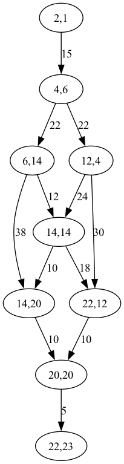
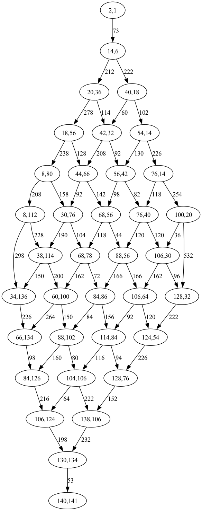

# 2023 Day 23: A Long Walk

## Part 1 

The problem is to find the longest path through a maze, with some one-way sections, and without revisiting any locations.  This is the same as the [Longest Path Problem](https://en.wikipedia.org/wiki/Longest_path_problem) described in Wikipedia.  It says that it can be solved for a _directed acyclic_ graph in O(n) time.  The problem is NP-hard for undirected graphs.

So -- is the graph directed and acyclic?  The test data looks that way after a short inspection.  It looks like every location with more than two neighbors, where there's a choice about where to go, is surrounded be arrows.  Let's write some code to find out. 

### Parsing 

My advent library includes parsing of character grids.

```haskell
type Problem = Grid

parse :: String -> Problem
parse = gridParse
```

### Is it a DAG? 

This ugly code checks whether the grid is consistent with a DAG, which is the case if every cell meets any of these criteria:

 - it's a wall (`#`) 
 - 2 or fewer neighbors is a wall ("or fewer" for entry and exit locations)
 - every neighbor is an arrow

```haskell
part1 :: Problem -> Int
part1 problem =
  length . traceShowId . filter (not . isConsistentWithDag . fst) . gridToList $ problem
  where
    boolToInt a = if a then 1 else 0

    isConsistentWithDag p =
      getAt p == '#' || length nonWall < 3 || all isArrow nonWall
      where
        nc = neighborChars p
        nonWall = filter (/= '#') nc
        isArrow c = c `elem` "<^>v"

    neighborChars = filter (/= ' ') . map getAt . neighbors

    getAt p = gridGet p problem

neighbors :: Point -> [Point]
neighbors p = [p + d | d <- directions]

directions :: [Point]
directions = [V2 1 0, V2 (-1) 0, V2 0 1, V2 0 (-1)]
```

Running this says that both the test case and the real input are DAGs.

## Convert to DAG

Maybe not?

Looking around, I haven't found any Haskell packages that handle DAGs with weighted edges, so converting it to a full-on graph may not be worth the trouble.  Maybe just implement the algorithm directly using recursion and memoization...

## Directly implement

We're going to want to search backwards, and when there's a choice pick the one with the longer path.  At each location, it'll need to look at all the preceding locations, make a recursive call on each one to get its length, and pick the highest one.

### Choices for previous location 

The first step will be to implement "what can the previous locations be?"  The code should not reverse course, so maybe it should carry along the current direction as it goes.

Both the test and the input start at the lower right, so we'll just hard-code that.  The direction in the state is the direction we stepped to get to this location; the previous point is known. 

```haskell
-- | Where the hike will be at the end. 
-- It will be in the goal location, headed out of the maze (down; positive y).
endState :: Grid -> (Point, Direction)
endState grid = 
    (V2 (x1 - 1) y1, V2 0 1)
    where 
        (_, V2 x1 y1) = gridBounds grid
```

And we'll probably also need the starting position to know when the seach is done.

```haskell
-- | Position where the hike starts. 
startPos :: Point 
startPos = V2 2 1
```

Working backwards from the end, we'll need to find all of the previous positions that don't just reverse direction, and are consistent with the arrows.  This code checks for arrows at both positions, which is probably not necessary.

```haskell
-- | All possible previous states.
-- The direction in the state is the direction of travel *leaving* the current location,
-- going to the next one.  This function is looking for the previous position, and that
-- direction is not yet chosen, but must be consistent with the arrow on the current
-- position.
--
-- Regular variables are the current state.  Prime vars are the previous state (p', d').
--
-- >>> prevStates sampleGrid (V2 3 2, V2 1 0)
-- [(V2 2 2,V2 1 0)]
--
-- >>> prevStates sampleGrid (V2 2 2,V2 1 0)
-- [(V2 2 1,V2 0 1)]
prevStates :: Grid -> (Point, Direction) -> [(Point, Direction)]
prevStates grid (p, d) =
  [ (p', d')
    | d' <- directions,
      d' /= opposite d, -- no backsies
      let p' = p + opposite d',
      isDirAllowed p d',
      isDirAllowed p' d'
  ]
  where
    -- Is the direction of travel consistent with the arrows?
    isDirAllowed px = charAndDirConsistent (gridGet px grid)

-- | The opposite of a direction
--
-- >>> opposite (V2 1 0)
-- V2 (-1) 0
opposite :: Direction -> Direction
opposite = fmap negate

charAndDirConsistent :: Char -> Direction -> Bool
-- charAndDirConsistent ' ' _ = True -- to allow getting TO the start location
charAndDirConsistent '.' _ = True
charAndDirConsistent '<' (V2 (-1) 0) = True
charAndDirConsistent '>' (V2 1 0) = True
charAndDirConsistent '^' (V2 0 (-1)) = True
charAndDirConsistent 'v' (V2 0 1) = True
charAndDirConsistent c d = False
```

### Longest path

Now, simple recursion should find us the longest path.  My guess is that it will be fast enough without memoization for the test case, but not for the real input.

```haskell
-- | Part 1
part1 :: Problem -> Int
part1 grid = longestPath grid startPos (endState grid)

-- | Search for the longest path to a given state.
longestPath ::
  Grid -> -- The maze we're exploring
  Point -> -- The starting position
  (Point, Direction) -> -- The current position
  Int -- The length of the path
longestPath grid start current@(curPos, _) =
  if curPos == start
    then 0
    else 1 + maximum (map (longestPath grid start) (prevStates grid current))
```

It turns out that's plenty fast.

## Part 2 

Part 2 removes the direction restrictions, and treats the maze as if all of the arrows are dots instead.

This means that loops are a possibility, so we'll need to keep track of history while searching.  And the search space is bigger.  I'm guessing that's going to make it hard.  It might be worth translating to a graph with weights on the edges, so we don't have to keep re-tracing paths every step of the way.  For now, thought, let's try brute force and see how it does.

### Keeping history

This updated `longestPath` keeps a history, and won't repeat any of those locations. 

```haskell
-- | Search for the longest path to a given state.
longestPath ::
  Grid -> -- The maze we're exploring
  Point -> -- The starting position
  S.Set Point -> -- The places we've been
  (Point, Direction) -> -- The current position
  Int -- The length of the path
longestPath grid start history current@(curPos, _) =
  if curPos == start
    then 0
    else 1 + maximum (map (longestPath grid start newHistory) prevs)
  where
    newHistory = S.insert curPos history
    prevs = filter (not . inHistory . fst) $ prevStates grid current
    inHistory p = p `S.member` history
```

With that change, part 1 still gets the right answer.

### Removing arrows

Part 2 uses an undirected graph.  Let's do that by removing the arrows in the grid and replacing them with dots.

```haskell
-- | Replace all arrows with dots in a grid
replaceArrows :: Grid -> Grid
replaceArrows =
  gridFromList . map updateOne . gridToList
  where
    updateOne (p, c) = (p, updateChar c)

    updateChar '<' = '.'
    updateChar '>' = '.'
    updateChar '^' = '.'
    updateChar 'v' = '.'
    updateChar c = c
```

With history checking and an undirected graph, we can write `part2`:

```haskell
-- | Part 2
part2 :: Problem -> Int
part2 g =
  longestPath g' startPos S.empty (endState g')
  where
    g' = replaceArrows g
```

And.. it doesn't work.

```
day23: Prelude.maximum: empty list
```

(One of these days I should figure out why it's not providing backtraces.)

The call to maximum is in `longestPath`.  It must be that it's gotten to a dead end and there are no options available.  That shouldn't be too hard to fix by having `longestPath` return `Maybe Int`.

### Dealing with dead ends

The call to `maximum` will need to deal with `Maybe` values, so we'll need a function to find the maximum of a list of Maybes.  I'm sure there's a more Haskell-y way to do this, but this will work:

```haskell
-- | The maximum of a list of Maybes, or Nothing if there are no values.
--
-- >>> maximumMaybes [Nothing]
-- Nothing
--
-- >>> maximumMaybes [Just 3, Nothing, Just 6]
-- Just 6
maximumMaybes :: (Ord a) => [Maybe a] -> Maybe a
maximumMaybes =
  go . catMaybes
  where
    go [] = Nothing
    go ns = Just (maximum ns)
```

And we can use that in `longestPath`:

```haskell
longestPath grid start history current@(curPos, _) =
  if curPos == start
    then Just 0
    else (+ 1) <$> maximumMaybes (map (longestPath grid start newHistory) prevs)
```

That gets the right answer for the test problem, and as I type this, it's still running on the real input.

(half an hour passes)

I guess that's just too slow.  Now it's time to optimize it.  I don't see another way to approach it.

### Converting to a weighted graph 

Instead of taking all N steps between nodes every time a path is traversed, let's convert the grid into a graph with weighted edges.  Vertices will be at every location in the grid where there is a choice about where to go, meaning that there are more that two directions you can go from the point.  Vertices will be named with `Point`s that are their locations in the grid.  Edges will have integer weights.

For convenience when searching, each edge will be represented as two directed edges, one going each way.

The type of a graph will be `Map Point [(Point, Int)]`, holding a list of possible destinations and distances from each vertex.

```haskell
-- | Build a weighted graph from the input grid.
-- Vertices are at places in the maze where there's a choice about where to go.
-- Edges are weighted with the number of steps from one vertex to the next.
--
-- >>> weightedGraph sampleGrid
-- fromList [(V2 2 1,[(V2 2 2,1)]),(V2 2 2,[(V2 2 1,1),(V2 4 4,4)]),(V2 4 4,[(V2 4 5,1)]),(V2 4 5,[(V2 4 4,1)])]
--
-- >>> weightedGraph (replaceArrows sampleGrid)
-- fromList [(V2 2 1,[(V2 2 2,1)]),(V2 2 2,[(V2 2 1,1),(V2 4 4,4)]),(V2 4 4,[(V2 2 2,4),(V2 4 5,1)]),(V2 4 5,[(V2 4 4,1)])]
weightedGraph :: Grid -> M.Map Point [(Point, Int)]
weightedGraph grid =
  M.fromList $ map addOutgoing allVertices
  where
    allVertices = [startPoint, endPoint] ++ choicePoints grid
    vertexSet = S.fromList allVertices
    addOutgoing v = (v, findOutgoing grid vertexSet v)
    startPoint = V2 2 1
    endPoint = fst . endState $ grid

-- | Find all of the walkable locations in the grid that have more than two walkable neighbors
--
-- These are the places where you have a choice where to turn, and 
-- they will be the vertices of the graph.
-- >>> choicePoints (replaceArrows sampleGrid)
-- [V2 2 2,V2 4 4]
choicePoints :: Grid -> [Point]
choicePoints grid =
  filter isChoicePoint . map fst . gridToList $ grid
  where
    isChoicePoint p = walkable (getAt p) && 2 < numWalkableNeighbors p
    numWalkableNeighbors = length . filter walkable . map getAt . neighbors
    getAt p = gridGet p grid
    walkable c = c `elem` ".<>^v"

-- | Find the outgoing edges from a vertex
findOutgoing :: Grid -> S.Set Point -> Point -> [(Point, Int)]
findOutgoing grid allVertices src =
  unique [edge | d <- directions, edge <- go src d 0]
  where
    -- All edges from a point `p` in a direction `d` having already taken `s` steps
    go p d s
      -- No answers if the direction of travel is not consistent with the place we're about to step.
      | not (charAndDirConsistent (gridGet p' grid) d) = []
      -- One answer if this step lands on one of the vertices
      | p' `S.member` allVertices = [(p', s + 1)]
      -- Otherwise, keep walking in any direction that is not backtracking
      | otherwise = [edge | d' <- directions, d' /= opposite d, edge <- go p' d' (s + 1)]
      where
        p' = p + d
```

### Displaying the graph

This temporary `main` function creates a graphviz graph. 

```haskell
main :: IO ()
-- main = run parse part1 part2
main = do
  text <- readFile "test.txt"
  let graph = weightedGraph . parse $ text
  let dotText = unlines . dot . M.toList $ graph
  writeFile "test.dot" dotText
  where
    dot graph = ["digraph {"] ++ edges graph ++ ["}"]
    edges = concatMap edgesFromVertex
    edgesFromVertex (src, es) =
      map oneEdge es
      where
        oneEdge (dst, steps) = "  " ++ vertexName src ++ " -> " ++ vertexName dst ++ " [ label =\"" ++ show steps ++ "\" ];"
        vertexName (V2 x y) = "\"" ++ show x ++ "," ++ show y ++ "\""
```

This is the test data:



And this is my real input data:



### Longest path using graph

It's a little more straightforward than doing the walking through the maze.

```haskell
-- | Find the longest path using a graph
--
-- >>> longestPathInGraph (weightedGraph sampleGrid) (V2 2 1) (V2 4 5)
-- 6
longestPathInGraph :: M.Map Point [(Point, Int)] -> Point -> Point -> Int
longestPathInGraph graph start end =
  fromJust $ go (S.singleton start) 0 start
  where
    go history steps current =
      if current == end
        then Just steps
        else maximumMaybes maybeNexts
      where
        maybeNexts =
          [ go (S.insert v history) (s + steps) v
            | (v, s) <- nexts current,
              not (v `S.member` history)
          ]
        nexts v = graph M.! v
```

### Redo part 1 with graph

It works.

```haskell
part1 :: Problem -> Int
part1 grid = longestPathInGraph (weightedGraph grid) startPos (fst (endState grid))
```

### Try part 2 

It's now fast enough.  Yay!

```haskell 
part2 :: Problem -> Int
part2 grid =
  longestPathInGraph (weightedGraph (replaceArrows grid)) startPos (fst (endState grid))
```